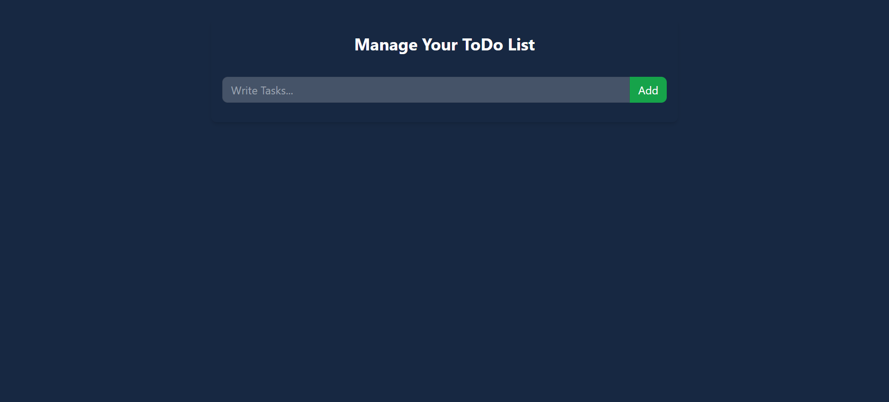

# Todo App

A simple React-based Todo application that allows users to manage their tasks effectively. The app includes features for adding, completing, editing, and deleting tasks, with persistent storage using localStorage.

## Features

- Add Tasks: Users can create new tasks by entering text in the input field and clicking the "Add" button.
- Complete Tasks: Tasks can be marked as complete by selecting a checkbox. Completed tasks are visually distinct with a line-through style.
- Edit Tasks: Editable tasks allow users to update their content. Tasks cannot be edited if they are marked as completed.
- Delete Tasks: Tasks can be removed entirely from the list by clicking the delete button.
- Local Storage Persistence: Tasks are saved to the browser's localStorage, ensuring that the list persists even after a page refresh.

## Installation

- Step 1: Clone the repository
  git clone https://github.com/yourusername/todo-app.git

- Step 2: Navigate into the project directory
  cd todo-app

- Step 3: Install dependencies
  npm install

- Step 4: Start the development server
  npm start

## Tech Stack
- React: Used for building the UI.
- JavaScript (ES6+): Application logic.
- CSS (Tailwind): Styling for components.
- LocalStorage: Persistent data storage.

## Contributing

If you'd like to contribute to this project:

- Fork the repository
- Create a new branch (git checkout -b feature-name)
- Make your changes
- Commit your changes (git commit -am 'Add feature')
- Push to your branch (git push origin feature-name)
- Open a pull request

## Screenshots

To provide a better understanding of the Recipe Book application, here is a screenshot:

##Main Interface

##Add Interface

##Edit Interface

##Complete Interface

